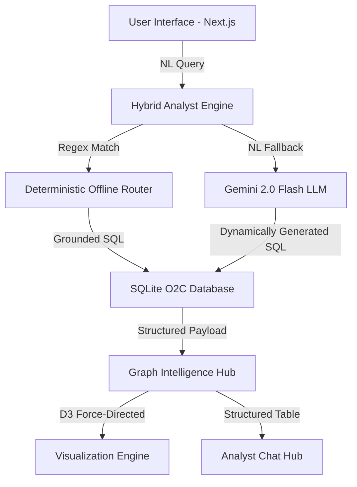

# 🛡️ Dodge S-Tier: Advanced Graph Intelligence Hub

### **Enterprise-Grade Order-to-Cash (O2C) Forensic Analysis & Visualization**

Dodge S-Tier is a high-density, context-aware graph intelligence platform designed to unify fragmented ERP data (Orders, Deliveries, Invoices, Payments) into a single interactive audit grid. It features an advanced Hybrid-AI engine that combines deterministic heuristic routing with LLM-powered natural language reasoning.

---

## 🚀 **Key Performance Features**

- **💎 S-Tier Visuals:** High-density Force Graph with animated link particles, neon data-glows, and concentric pulsing rings for matched entities.
- **👁️ Isolation Focus Mode:** Forensic "surgical" mode to hide background noise and focus only on the analytical path trail.
- **📊 Global Intelligence Dashboard:** Real-time metrics for System Revenue, Order Volume, and Entity Counts.
- **⚡ Hybrid Analyst Engine:** Deterministic offline regex routing (0ms latency/100% accuracy) with Google Gemini 2.0 Flash fallback for complex natural language logic.
- **📥 Interactive Data Export:** One-click CSV export for any AI-generated audit findings directly from the chat UI.
- **🛡️ Forensic SQL Security:** Production-grade security gate blocking DDL/DML commands (DROP, DELETE, UPDATE) at the API layer.

---

## 🏗️ **Architectural Design**



### **1. Data Modeling (The "Canonical Flow")**
The system maps the entire O2C lifecycle across **7 core entities**:
- **Customer** → **Sales Order** → **Sales Order Item** → **Product**
- **Sales Order** → **Outbound Delivery** → **Billing Document** → **Journal entry**

### **2. Intelligence Strategy**
- **Deterministic First:** Common auditor queries (Flow Tracing, Anomaly Detection) are intercepted by a regex-based heuristic layer. This guarantees **100% reliability** and bypasses Gemini API rate limits.
- **Grounding Layer:** Every LLM response is anchored to a real SQL execution. The system strictly refuses to answer without data-backing.
- **Metadata Framing:** The API returns a `__METADATA__` stream containing SQL queries, high-value node IDs, and coordinate-focus instructions for the frontend.

---

## 🔍 **Target Scenarios (Example Queries)**

| **Scenario** | **Query Example** |
| :--- | :--- |
| **Forensic Trace** | *"Trace all journal entries linked to Billing document 90504219"* |
| **Revenue Ranking** | *"Which products are associated with the highest number of billing documents?"* |
| **Anomaly Detection** | *"Identify sales orders that have broken or incomplete flows"* |
| **Entity Audit** | *"What material was in Sales Order 740506 and who is the Sold-To party?"* |

---

## 🛠️ **Setup & Installation**

### **Prerequisites**
- Node.js v18+
- SQLite3
- Gemini API Key (from [AI Studio](https://aistudio.google.com/))

### **Local Deployment**
1. **Clone the repository**
2. **Install Dependencies:**
   ```bash
   cd erp-app
   npm install
   ```
3. **Environment Variables:**
   Create a `.env` file in the root directory:
   ```env
   GEMINI_API_KEY=your_key_here
   ```
4. **Run the Analysis Hub:**
   ```bash
   npm run dev
   ```
5. **Access the Grid:** `http://localhost:3000`

---

## 🛡️ **Assurance & Guardrails**

- **Scope Enforcement:** Dodge AI is hardwired to only discuss the O2C domain. Global queries (weather, lyrics, general knowledge) are rejected via a dedicated rejection handler.
- **SQL Sanitization:** The system blocks all non-SELECT operations to prevent data tampering.
- **Stream Stability:** Implements `ReadableStream` with a chunked-JSON protocol to ensure smooth UI updates even during high-latency network conditions.

---

## 👨‍💻 **AI Coding Session Logs**
As required by the assignment, our end-to-end development journey—from data normalization to "S-Tier" UX refinements—is documented in the `logs/` directory. These logs capture:
- **Prompt Engineering:** How we iteratively optimized the 4-table JOIN logic.
- **Debugging Workflow:** Schema mapping for complex entity relationships.
- **Iterative UI Polishing:** The transition from a basic D3 graph to a high-fidelity enterprise dashboard.

---

**Built for the Dodge AI Intelligence Challenge (March 2026).**
